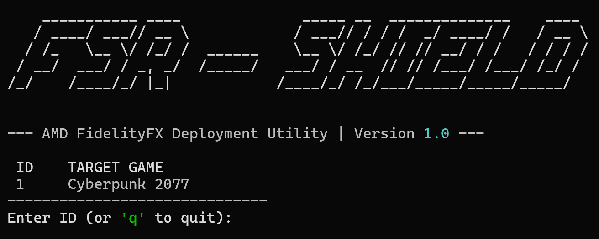

# FSR - SHIELD



**AMD FidelityFX Super Resolution Deployment Utility**

## Overview

**FSR - SHIELD** is a secure, automated command-line tool designed to help gamers and enthusiasts update the AMD FidelityFX Super Resolution (FSR) libraries (DLLs) in their supported games.

Game developers often ship titles with a specific version of FSR. However, AMD frequently updates their SDK with ghosting fixes, performance improvements, and stability enhancements. This tool allows you to safely upgrade a game's FSR version to the latest one available from the official source.

## Features

- **Automated Fetching:** Queries the official [AMD GPUOpen GitHub repository](https://github.com/GPUOpen-LibrariesAndSDKs/FidelityFX-SDK) for the latest FSR SDK releases.
- **Smart Detection:** Automatically locates supported games installed via Steam (currently supports _Cyberpunk 2077_).
- **Security First:** Verifies the SHA-256 hash of downloaded archives against a trusted local manifest to prevent tampering or corruption.
- **Safety Net:** Automatically creates backups of original game files before applying any changes, ensuring you can always roll back.
- **User Friendly:** A clean, interactive CLI interface.

## Technical Background & Motivation

This project was built to address the risks associated with the common practice of "DLL Swapping" in the PC gaming community.

While manually replacing `ffx_fsr2_x64.dll` can significantly improve image quality in some titles, doing so manually is risky:

1.  **Security:** Downloading DLLs from third-party "DLL fix" websites is a major security vector for malware.
2.  **Stability:** Using the wrong version or architecture can crash games.
3.  **Irreversibility:** Users often forget to back up their original files.

**FSR - SHIELD** solves this by:

- **Chain of Trust:** It _only_ downloads from the official AMD repository.
- **Integrity:** It checks cryptographic signatures before extracting any files.
- **Automation:** It handles the correct path mapping (e.g., `bin/x64`) and backup creation programmatically.

## Installation

### Prerequisites

- Python 3.8 or higher
- An active internet connection (to fetch the SDK)

### Setup

1. **Clone the repository:**

   ```bash
   git clone https://github.com/N0laa/fsr-shield.git
   cd fsr-shield
   ```

2. **Install dependencies:**
   It is recommended to use a virtual environment.

   ```bash
   # Create virtual environment
   python -m venv .venv

   # Activate it (Windows)
   .venv\Scripts\activate

   # Install requirements
   pip install -r requirements.txt
   ```

## Usage

1. **Run the tool:**

   ```bash
   python src/main.py
   ```

2. **Follow the on-screen instructions:**
   - The tool will scan for supported games on your system.
   - Select the ID of the game you wish to update.
   - The tool will download the latest FSR SDK, verify it, and ask for confirmation before installing.

## Disclaimer

This software is an unofficial utility and is not affiliated with AMD, CD Projekt Red, or any other game developers. Modifying game files is generally safe for single-player games, but use this tool at your own risk.
